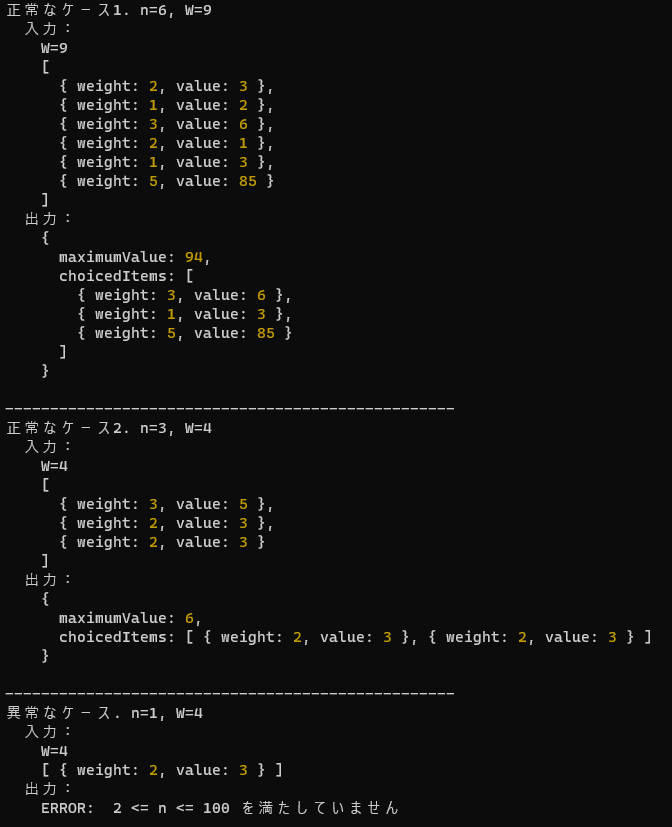
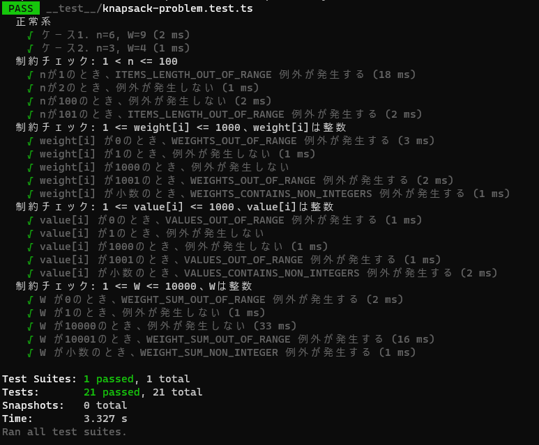

# 提出課題
## 課題内容
n 個の品物があり、i 番目の品物のそれぞれ重さと価値が weight[i],value[i]となっている (i=0,1,...,n−1)。  
これらの品物から重さの総和が W を超えないように選んだときの、価値の総和の最大値を求めよ。  

[制約]
- 1 < n <= 100
- weight[i],value[i]は整数
- 1 <= weight[i],value[i] <= 1000
- 1 <= W <= 10000

---

## 提出物の実行結果 

[問題を解くロジック](./src/knapsack-problem/index.ts) を サンプルコード、テストコードそれぞれで実行しました。

### サンプルコード
[サンプルコード](./src/index.ts) を実行すると次のような結果となります。  
価値の総和の最大値の他、どの品物を選択したかも表示するように作成しています。  
<div>

</div>
  

### テストコード
[テストコード](<./__test__/knapsack-problem.test.ts>) を実行すると次のような結果になります。  
正常系では2パターンのテストケースを実行し、以下の点について確認しています。
 - プログラムが求めた「価値の総和の最大値」が期待値と等しいこと。  
 - プログラムが「価値の総和の最大値」を求めた際に選択した「品物の組み合わせ」が期待値と等しいこと。  
  
異常系では、与えられた制約を満たしているか確認として「境界値テスト」ならびに「整数であることの判定」を実施しています。    

<div>

</div>


---

## 提出物の実行手順

### 準備
```
git clone https://github.com/kk-portfolio/submit.git
cd submit
npm install
npm run build
npm link
```

### サンプルコードの実行
下記いずれかのコマンドで [サンプルコード](./src/index.ts) を実行できます。
#### ビルド後のファイルパスを指定：
```
node dist/main.js
```
#### シンボリックリンク：
```
run-sample
```

### テストコードの実行
下記のコマンドで [テストコード](<./__test__/knapsack-problem.test.ts>) を実行できます。
```
npm run test
```


